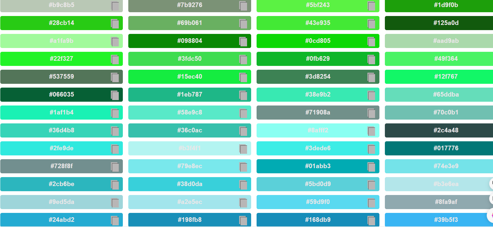

# Color-Bank

Color-Bank is a visually appealing project that showcases thousands of color hex values. Users can explore various colors, copy their hex values, and easily incorporate them into their projects.

## Overview

Color-Bank provides a user-friendly interface to explore a vast array of colors. Whether you are a designer, developer, or simply someone who appreciates beautiful color combinations, this project is a valuable resource.

## Features

- Explore thousands of color hex values.
- Copy hex values with a single click.
- Seamless integration into your projects.

## Screenshots

*Caption: random colors*

## Getting Started

Follow these instructions to get started with [Your Project Name].

### Prerequisites

- Web browser (Chrome, Firefox, Safari, etc.)

### Usage

1. Open https://color-bank.netlify.app in your web browser.
2. Explore the vast collection of color hex values.
3. Click on a color to copy its hex value.
4. Paste the hex value into your project.

---

Happy color exploring!
